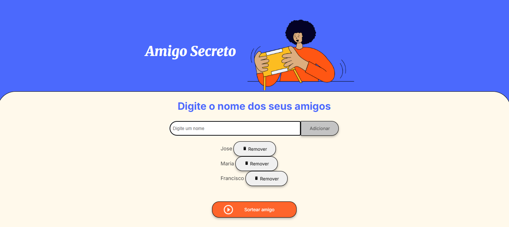
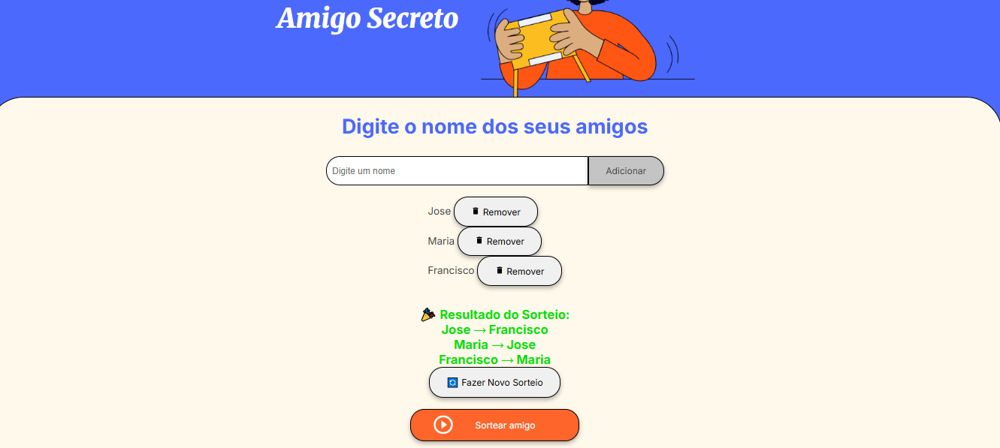

# 🎁 Sistema de Amigo Secreto
Um sistema web interativo para sortear amigo secreto, desenvolvido com HTML, CSS e JavaScript puro.

📋 Sobre o Projeto
O Sistema de Amigo Secreto é uma aplicação web que permite organizar sorteios de amigo secreto de forma simples e divertida. Com uma interface moderna e intuitiva, o sistema garante que todos os participantes sejam incluídos no sorteio e que ninguém tire a si mesmo.
✨ Funcionalidades

✅ Adicionar participantes com validação em tempo real
✅ Remover participantes individualmente com confirmação
✅ Algoritmo inteligente que impede auto-sorteio
✅ Interface responsiva para desktop e mobile
✅ Validações robustas (nomes únicos, mínimo 2 participantes)
✅ Feedback visual com notificações elegantes
✅ Suporte a teclado (Enter para adicionar)
✅ Resultados organizados em pares
✅ Opção de novo sorteio mantendo a mesma lista

🚀 Como Usar

Clone o repositório:
bashgit clone https://github.com/Hermyson/amigo-secreto.git
cd amigo-secreto

Abra o arquivo index.html no seu navegador

Duplo clique no arquivo
Ou arraste para o navegador
Ou use um servidor local como Live Server

Use o sistema:

Digite o nome dos participantes
Clique em "Adicionar" ou pressione Enter
Quando tiver pelo menos 2 participantes, clique em "Sortear amigo"
Visualize os resultados e faça novos sorteios se necessário

📁 Estrutura do Projeto
amigo-secreto/
├── index.html          # Estrutura HTML principal
├── style.css           # Estilos e layout
├── app.js             # Lógica JavaScript
├── assets/            # Imagens e recursos
│   ├── amigo-secreto.png
│   └── play_circle_outline.png
└── README.md          # Documentação
🎨 Preview
Tela Principal

Interface limpa e moderna
Campo de input para adicionar nomes
Lista de participantes com opção de remoção

Resultado do Sorteio

Exibição clara dos pares sorteados
Opção para fazer novo sorteio
Animações suaves e feedback visual

🛠️ Tecnologias Utilizadas

HTML5 - Estrutura semântica
CSS3 - Estilização moderna e responsiva
JavaScript ES6+ - Lógica de funcionamento
Google Fonts - Tipografia (Inter e Merriweather)

🧠 Algoritmo de Sorteio
O sistema utiliza um algoritmo inteligente que:

Cria uma lista de participantes disponíveis
Para cada pessoa, remove ela mesma das opções
Escolhe aleatoriamente um amigo secreto das opções restantes
Remove o escolhido da lista de disponíveis
Repete o processo até todos terem um par
Em caso de impasse, reinicia o processo (máximo 100 tentativas)

📱 Responsividade
O sistema é totalmente responsivo e funciona perfeitamente em:

💻 Desktop - Experiência completa
📱 Tablet - Layout adaptado
📱 Mobile - Interface otimizada para toque

🔧 Funcionalidades Avançadas
Validações Implementadas

Campo não pode estar vazio
Nomes não podem ser duplicados
Mínimo 2 participantes para sortear
Algoritmo anti-loop infinito

Experiência do Usuário

Notificações elegantes
Confirmação antes de remover participantes
Foco automático no campo de input
Scroll suave para resultados
Feedback visual em todas as ações

🤝 Como Contribuir

Fork este repositório
Crie uma branch para sua feature (git checkout -b feature/nova-funcionalidade)
Commit suas mudanças (git commit -m 'Adiciona nova funcionalidade')
Push para a branch (git push origin feature/nova-funcionalidade)
Abra um Pull Request

📝 Possíveis Melhorias

 Salvar histórico de sorteios no localStorage
 Exportar resultados em PDF
 Adicionar tema escuro
 Integração com API de email
 Adicionar regras personalizadas (ex: casais não podem tirar um ao outro)
 Modo offline com PWA
 Internacionalização (i18n)

📄 Licença
Este projeto está sob a licença MIT. Veja o arquivo LICENSE para mais detalhes.
👨‍💻 Autor
Desenvolvido com ❤️ por [Alura/ONE e Hermyson]

GitHub: https://github.com/Hermyson
LinkedIn: www.linkedin.com/in/hermyson-oliveira

🌟 Mostre seu apoio
Se este projeto te ajudou, deixe uma ⭐ no repositório!